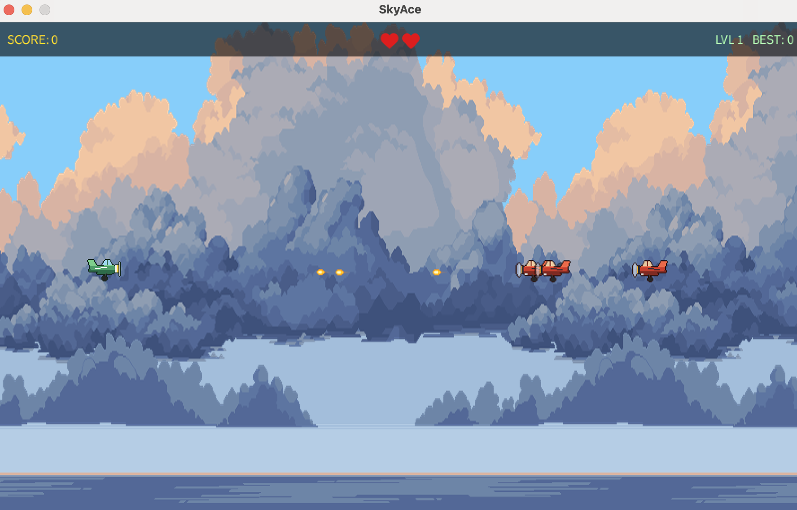

# Sky Ace

A side-scrolling dogfight shooter built in Processing (Java mode). Survive endless waves of enemy planes, rack up points, and beat your best score.

Solo student project, Georgia Gwinnett College.

## How to play

- **Move:** W A S D or arrow keys
- **Shoot:** Spacebar
- **Start:** Enter
- You have 3 lives. Each life takes 3 hits to lose; each enemy takes 4 hits.
- Smoke shows damage: grey = 1 hit, black = 2 hits.
- Each kill is worth 5 points. Difficulty rises every 25 points up to Level 4, with faster and more numerous enemies (max 5 at once).

## Features

- Endless play until you run out of lives, with score and best score
- 4 difficulty levels with scaling enemy speed, fire rate and count
- Enemy planes that track and chase the player
- Health and damage states with smoke trails and a death animation
- Sprite-based explosions, animated planes, parallax-style scrolling sky
- Sound effects and music via the Processing Sound library

## Run it

1. Install [Processing 4](https://processing.org/download).
2. In Processing: **Sketch > Import Library > Manage Libraries**, and install **Sound**.
3. Open `SkyAce/SkyAce.pde` and press Run.

The `data/` folder (images and audio) must stay next to the `.pde` files.

## Code

| File | Purpose |
| --- | --- |
| `SkyAce.pde` | Main loop, game states, levels, input |
| `Plane.pde` | Player plane, movement, damage, death sequence |
| `EnemyPlane.pde` | Enemy AI, shooting, damage |
| `Bullet.pde` | Projectiles |
| `Explosion.pde` | Explosion and smoke effects |
| `Background.pde` | Scrolling sky layers |

## Credits

**Code and title logo (`title.png`):** Jonathan

**Music** (CC-BY-SA 3.0, used unmodified)
- ["music" by fx10243](https://opengameart.org/content/music-2): `bird.mp3`, `seashore.mp3`
- License: [CC-BY-SA 3.0](https://creativecommons.org/licenses/by-sa/3.0/). These two files are not covered by the code license.

**Backgrounds** (`Ocean*.png`)
- ["Free Sky Backgrounds"](https://free-game-assets.itch.io/free-sky-with-clouds-background-pixel-art-set) by Free Game Assets / CraftPix.net
- [CraftPix freebie license](https://craftpix.net/file-licenses/). Used as in-game backgrounds. Do not reuse these files as a standalone art pack.

**Sprites and sound effects**
- Plane, bullet, explosion and smoke sprites, and the shot, explosion, engines and diving sounds, were generated with Python scripts written with AI assistance (Claude). They are original, not taken from other works.

Full credits are also in `CREDITS.txt`.
